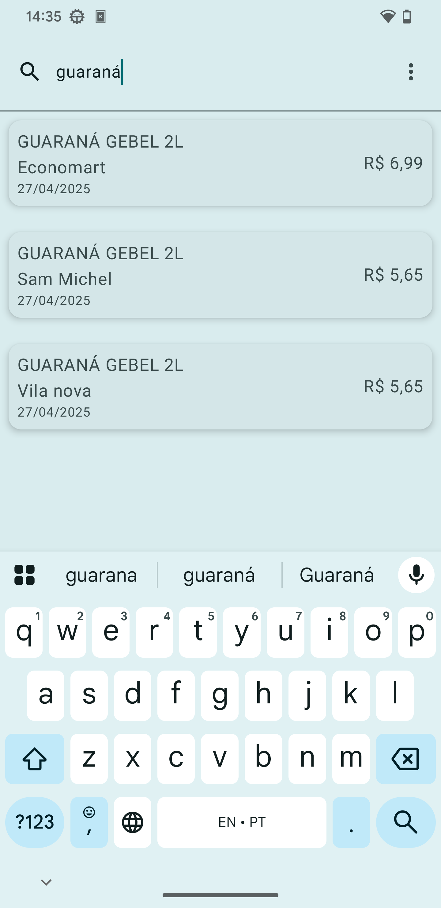
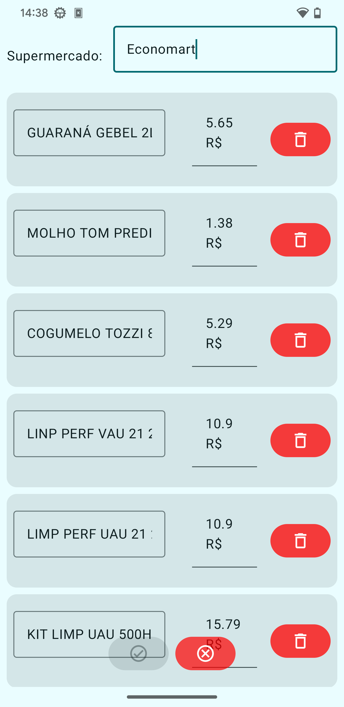

# Compra Inteligente

## Introduction

Compra Inteligente is an Android native application designed to help users manage their grocery expenses by scanning supermarket receipts and storing product details with prices. As more receipts are scanned, our growing database allows you to compare prices across various supermarkets, helping you find the best deals effortlessly.

## Key Features

- **Receipt Scanning**: Utilize OCR technology to scan and extract product details from receipts.
- **Price Comparison**: Analyze prices across different supermarkets to find the best deals.
- **Local & Private Storage**: All data is stored locally on your device, ensuring complete privacy.

## Development Details

### Architecture

- **Clean Architecture**: We follow clean architecture principles to ensure a scalable and maintainable codebase. This separation of concerns makes our app robust and testable.

### Dependency Injection

- **Koin for DI**: Koin is used for dependency injection to manage the application's dependencies efficiently, providing a lightweight and pragmatic approach compared to other frameworks.

### User Interface

- **Jetpack Compose & Material You**: The UI is built using Jetpack Compose, which allows us to create native Android interfaces with less boilerplate code. It is styled with Material You for a modern and responsive design.

### OCR Technology

- **Tesseract for OCR**: We utilize Tesseract, an open-source OCR engine, to extract text from scanned receipts, enabling the accurate extraction of product names and prices.

## Roadmap

### v1.0: Foundation
- First functional release with most intended features.
- Core functionality is established but may need refinement in future updates.

### v2.0: Smart
- Introduce AI enhancements for more reliable product scanning from receipts.
- Minor improvements and bug fixes based on user feedback.

### v3.0: Global
- Add support for multiple languages to expand usability internationally.
- Enable data export functionality in various formats and destinations, improving interoperability with other tools and services.

## Current Limitations

- **Language & Currency**: Currently supports only Portuguese (Brazil) for language and currency.
- **OCR Accuracy**: Relies on regex patterns for product identification which can fail if OCR is suboptimal. This may lead to incorrect product names or prices, an issue we aim to improve in future releases.

## Contributing

---

For more details on how to set up the development environment, refer to our [Setup Guide](link_to_setup_guide).

Thank you for considering Compra Inteligente. We look forward to helping you save money while shopping smarter!
