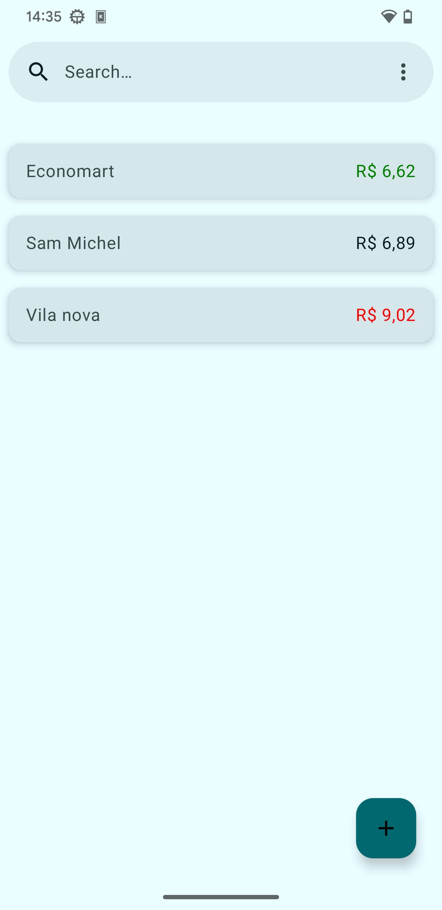

# Choose Language

  <a href="#portuguese-brasil">Português (Brasil)</a> | <a href="#english">English</a>

## English

### Compra Inteligente

  

    
    
    
  

  

    
    
    
  

#### Introduction
Compra Inteligente is an Android native application designed to help users manage their grocery expenses by scanning supermarket receipts and storing product details with prices. As more receipts are scanned, our growing database allows you to compare prices across various supermarkets, helping you find the best deals effortlessly.

#### Key Features
- **Receipt Scanning**: Utilize OCR technology to scan and extract product details from receipts.
- **Price Comparison**: Analyze prices across different supermarkets to find the best deals.
- **Local & Private Storage**: All data is stored locally on your device, ensuring complete privacy.

#### Development Details

- **Clean Architecture**
- **Koin for DI**: Koin is used for dependency injection to manage the application's dependencies efficiently. This allows a future migration to KMP (Kotlin Multiplaform)

- **Jetpack Compose & Material You**
- **Tesseract & google ML kit for OCR**: we first use google ML document scanner to pre-process and crop the image of the receipts before passing it to Tesseract, imprving the OCR results. 
#### Roadmap

##### v1.0: Foundation
- First functional release with most intended features.
- Core functionality is established but may need refinement in future updates.

##### v2.0: Smart
- Introduce AI enhancements for more reliable product scanning from receipts.
- Minor improvements and bug fixes based on user feedback.

##### v3.0: Global
- Add support for multiple languages to expand usability internationally.
- Enable data export functionality in various formats and destinations, improving interoperability with other tools and services.

#### Current Limitations
- **Language & Currency**: Currently supports only English with Brazilian currency.
- **OCR Accuracy**: Relies on regex patterns for product identification which can fail if OCR is suboptimal. This may lead to incorrect product names or prices, an issue we aim to improve in future releases.

#### License
---

This project is licensed under the **GNU General Public License v3.0 (GPL-3.0)**. You are free to use, modify, and distribute this software under the terms of this license.  

Additionally, this project depends on the following third-party libraries, each with their respective licenses:  
- **Tesseract** (Apache License 2.0)  
- **Leptonica** (Custom License - Redistribution permitted with conditions)  
- **libpng** (Custom License - Redistribution permitted with conditions)  

Please refer to the respective licenses for more details regarding their terms and conditions.
---

## Portuguese (Brasil)

### Compra Inteligente

  

    
    
    
  

  

    
    
    
  

#### Introdução
Compra Inteligente é um aplicativo nativo Android projetado para ajudar os usuários a gerenciar seus gastos com compras de supermercado ao escanear recibos e armazenar detalhes dos produtos com seus preços. À medida que mais recibos são escaneados, o banco de dados creçe permitindo comparar preços entre vários supermercados, ajudando você a encontrar as melhores ofertas sem esforço.

#### Recursos Principais
- **Escaneamento de tickets**: Utilize tecnologia OCR para escanear e extrair detalhes dos produtos dos recibos.
- **Comparação de Preços**: Analise preços em diferentes supermercados para encontrar as melhores ofertas.
- **Armazenamento Local & Privado**: Todos os dados são armazenados localmente no seu dispositivo, garantindo privacidade completa.

#### Detalhes do Desenvolvimento

- **Clean Architecture**
- **Koin for DI**: Koin é usado para a injeção de dependencias principalmente pela sua facilidade de uso e suporte para KMP (Kotlin Multiplatform), permitindo que no futuro o app possa funcionar tanto em Android como iOS

- **Jetpack Compose & Material You**
- **Tesseract & google ML kit for OCR**: utilizamos o escáner de docuemntos da google ML para pre-processar os tickets e depois utilizamos o procesamento OCR do Tesseract para assim conseguir os melhores resultados

#### Roadmap

##### v1.0: Fundação
- Primeiro lançamento funcional com a maioria das funcionalidades pretendidas.
- A funcionalidade principal é estabelecida mas pode precisar de refinamentos em atualizações futuras.

##### v2.0: Inteligente
- Introduzir melhorias baseadas em IA para um escaneamento mais confiável dos produtos nos recibos.
- Melhorias menores e correções de bugs com base no feedback do usuário.

##### v3.0: Global
- Adicionar suporte a múltiplos idiomas para expandir a usabilidade internacionalmente.
- Habilitar funcionalidade de exportação de dados em diversos formatos e destinos, melhorando a interoperabilidade com outras ferramentas e serviços.

#### Limitações Atuais
- **Idioma & Moeda**: Atualmente suporta apenas inglês com moeda brasileira.
- **Precisão do OCR**: Dependente de padrões regex para identificação dos produtos que podem falhar se o OCR não for preciso. Isso pode levar a nomes ou preços de produtos incorretos, um problema que buscamos melhorar em atualizações futuras.

#### Licenças
Este projeto é licenciado sob a **GNU General Public License v3.0 (GPL-3.0)**. Você é livre para usar, modificar e distribuir este software de acordo com os termos desta licença.  

Além disso, este projeto depende das seguintes bibliotecas de terceiros, cada uma com suas respectivas licenças:  
- **Tesseract** (Licença Apache 2.0)  
- **Leptonica** (Licença Personalizada - Redistribuição permitida com condições)  
- **libpng** (Licença Personalizada - Redistribuição permitida com condições)  

Consulte as respectivas licenças para mais detalhes sobre seus termos e condições.
---
